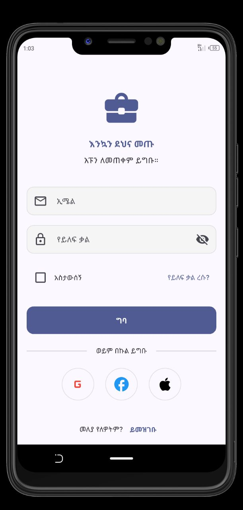
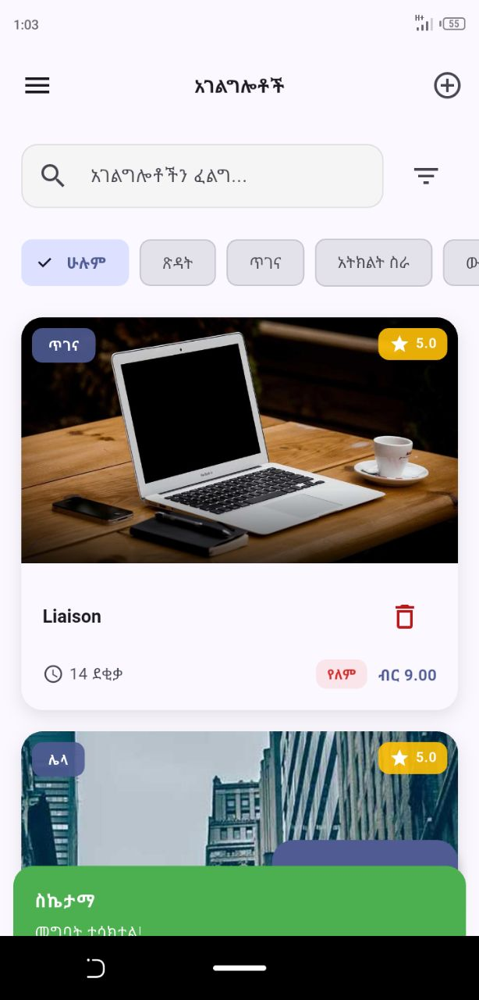
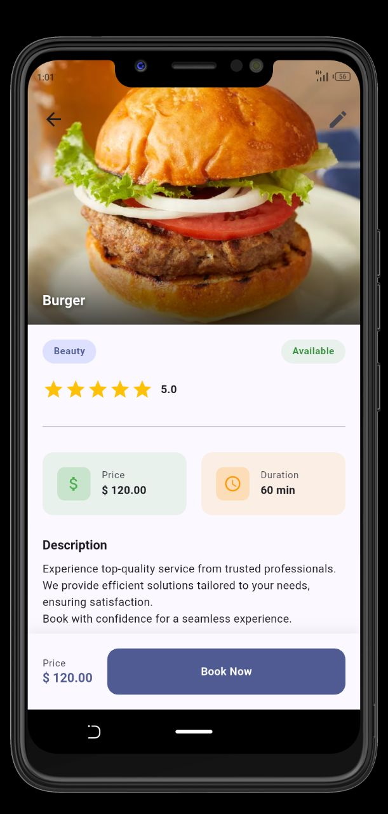
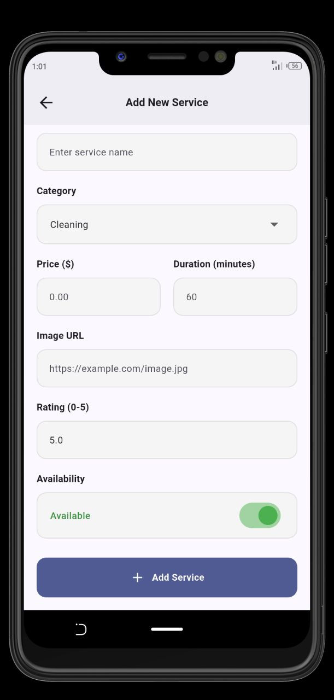
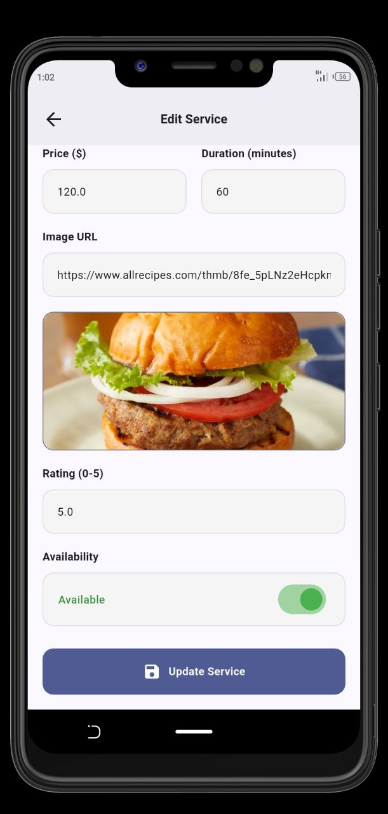
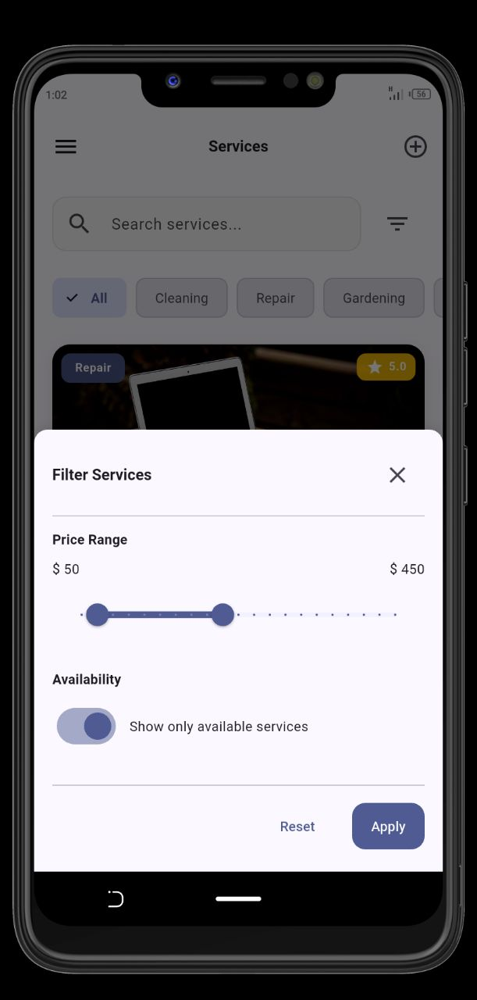
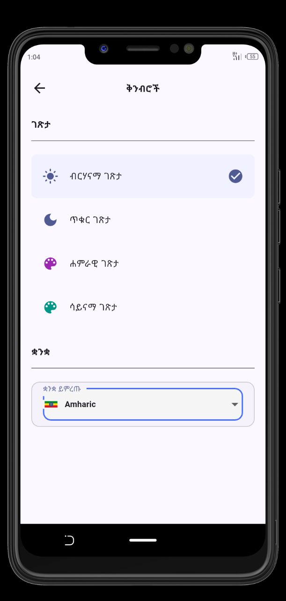
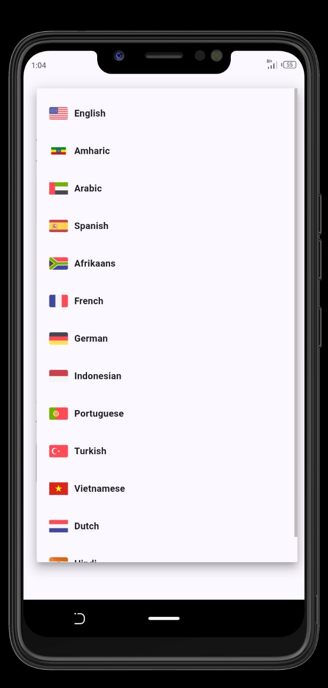
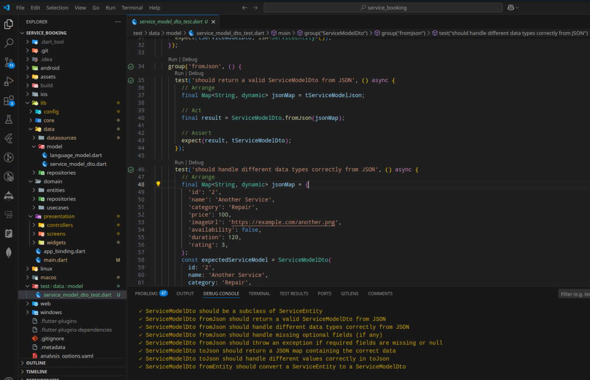

# Mini Service Booking App

## 📄 Project Overview

This project is a Flutter frontend application developed as per the requirements for the Mini Service Booking App . It provides a user interface to manage a list of services by interacting with a public REST API.

The application demonstrates:

- Implementation of basic CRUD functionality for services.
- Adherence to Clean Architecture principles (presentation, domain, data layers).
- Utilization of GetX for state management, routing, bindings, and dependency injection.
- Consumption of a public REST API (which is mockapi.io).
- A user-friendly UI with loading indicators, notifications, and form validation.

## 🛠️ Setup Instructions

To set up and run this project locally, ensure you have the Flutter SDK installed and configured.

1.  **Clone the repository:**

```
git clone https://github.com/TitusKI/service_booking
```

2.  **Navigate to the project directory:**

```
cd service_booking
```

3.  **Get dependencies:**

```
flutter pub get
```

4.  **Run the application:**
    Connect an emulator or device and run:

```
flutter run
```

## 📸 Screenshots

Here are a few screenshots of the application:


<table>
  <tr>
    <td align="center">
      
      <br>
      Login Screen
    </td>
    <td align="center">
      
      <br>
      Service List Screen
    </td>
  </tr>
  <tr>
    <td align="center">
      
      <br>
      Service Detail Screen
    </td>
    <td align="center">
      
      <br>
      Add New Service Screen
    </td>
  </tr>
   <tr>
    <td align="center">
      
      <br>
      Edit Service Screen
    </td>
    <td align="center">
      
      <br>
      Search Filter Screen
    </td>
  </tr>
   <tr>
    <td align="center">
      
      <br>
      Settings Screen
    </td>
     <td align="center">
      
      <br>
      Language Screen
    </td>
  </tr>
</table>

## ✨ Breakdown of Implemented Features

The application successfully implements the core CRUD functionalities and several features:

**Core Features (CRUD for Services):**

- **View Service List:** Displays a list of available services fetched from the API.
- **View Service Details:** Shows detailed information for a selected service.
- **Add New Service:** Allows users to add a new service via a form.
- **Edit Service:** Enables users to modify existing service details.
- **Delete Service:** Provides functionality to remove a service.

**Technical Features:**

- **GetX Bindings & DI:** It utilizes AppBinding for efficient dependency injection.
- **Loading/Error Handling:** It displays loading indicators during API calls and handles basic API errors with user feedback (e.g., snackbars).
- **Form Validation:** It implements on the Add/Edit screen with inline error messages.
- **Efficient Widgets:** Uses ListView.builder for list rendering.

**Other Features:**

- **Search & Filter:** Implemented search by service name and filter by category and price range.
- **Animations:** Includes Hero animations for smooth transitions.
- **Multi-language (i18n):** Supports 13 languages using GetX internationalization.
- **Basic Onboarding and Authentication Simulation:** Features a simple onboarding page and login page for flow demonstration.

## 💾 Local Storage

The application utilizes **GetStorage** for local data persistence and caching. This is used for:

- Storing and retrieving the user's preferred language.
- Storing and retrieving the user's preferred theme (light/dark mode).
- Tracking whether the onboarding process has been completed.
- Simulating user login state.
- **Caching fetched services from the API.** If there is no internet connection, the application attempts to display the last fetched data from local storage, providing a basic offline experience.

This local storage mechanism enhances the user experience by remembering preferences and providing data availability even without a network connection for previously fetched data.

The application also utilizes **CachedNetworkImage** for efficient image loading and caching from the network, improving performance and reducing data usage.

## 🧪 Testing

Unit tests have been implemented for the `ServiceModelDto` to ensure correct data mapping between JSON and the application's data model. These tests cover:

- Deserialization (`fromJson`) to verify that JSON data received from the API is correctly converted into `ServiceModelDto` objects.
- Serialization (`toJson`) to verify that `ServiceModelDto` objects are correctly converted back into JSON format for sending data to the API (e.g., for adding or updating services).
- Conversion from `ServiceEntity` to `ServiceModelDto` (`fromEntity`).

These tests are crucial for validating the data layer's ability to handle data transformations reliably.

Here is a screenshot showing the successful execution of these tests:



To run these tests, navigate to the project root in your terminal and execute:

```
flutter test test/data/model/service_model_dto_test.dart
```

## 📂 Folder Structure Explanation

The project follows a standard Clean Architecture structure to organize code logically and separate concerns:

```lib/
 ├── config/           # Application-level configurations (themes, translations, services)
 ├── core/             # Cross-cutting concerns (constants, errors, utilities)
 ├── data/             # Data sources (remote/local), models (DTOs), repository implementations
 ├── domain/           # Core business logic (entities, repository interfaces, use cases)
 └── presentation/     # UI layer (screens, widgets, GetX controllers)
```

This structure promotes maintainability and scalability by clearly defining the responsibilities of each layer.

---
